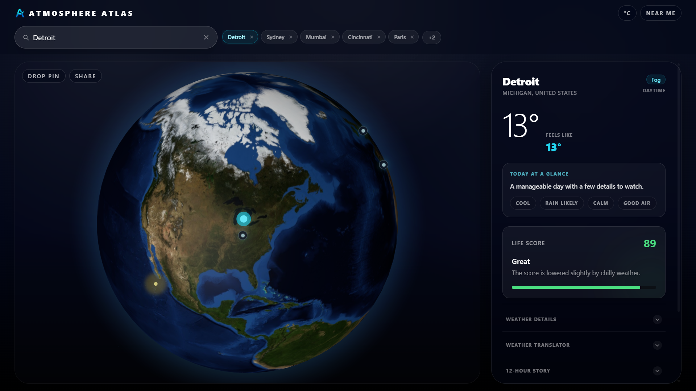
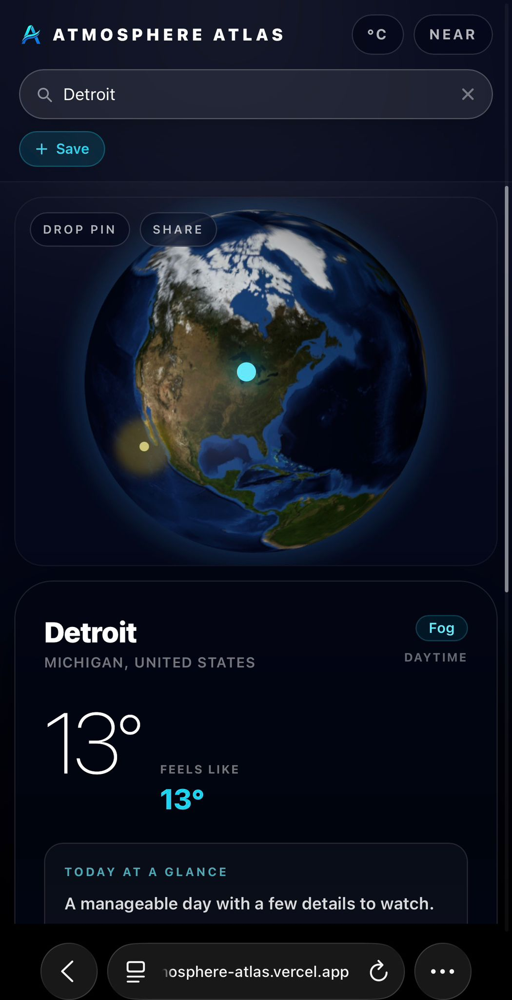
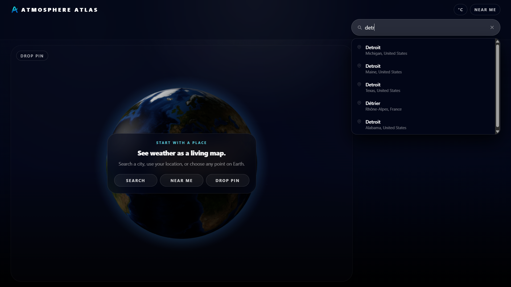
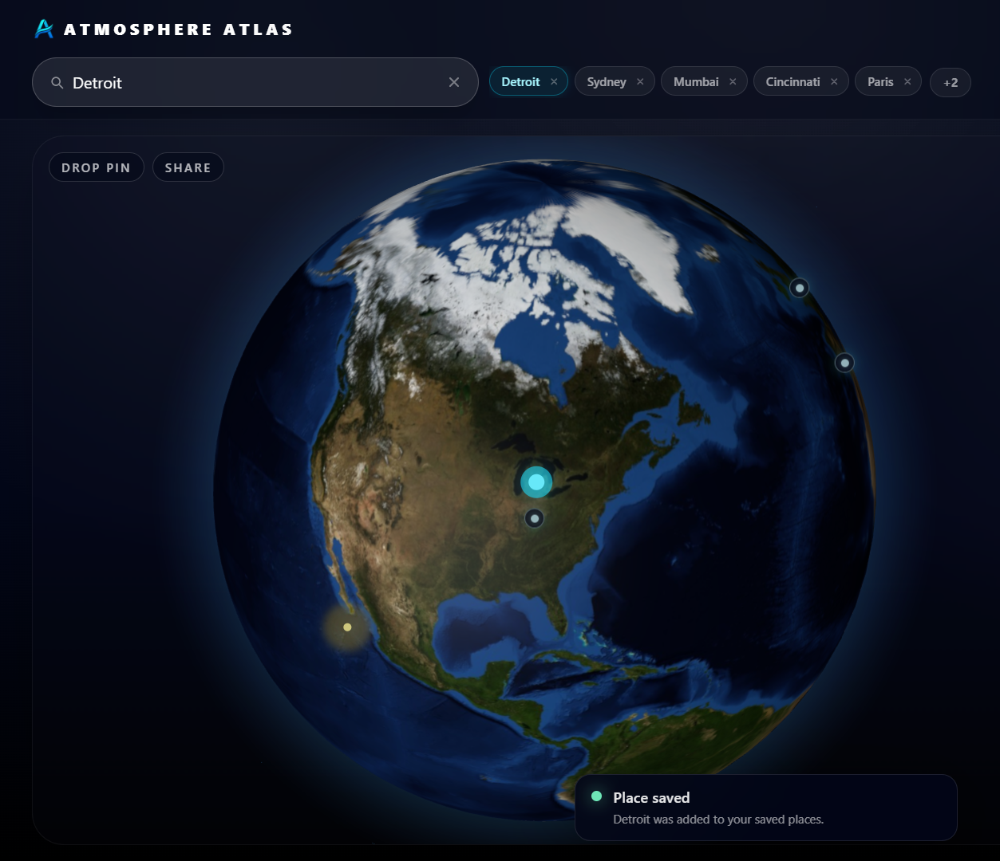
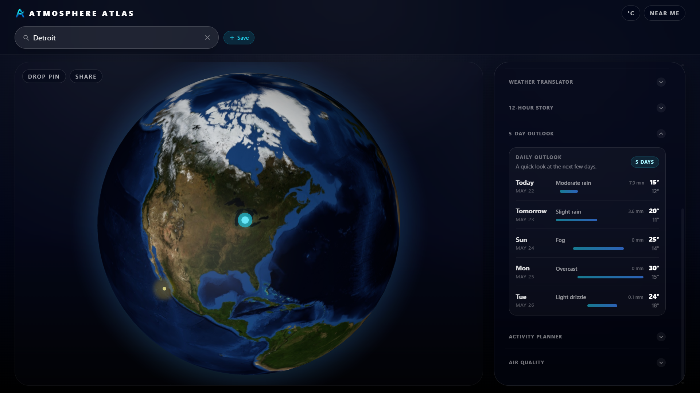

# 🌍 Atmosphere Atlas

<p align="center">
  
</p>

<h3 align="center">A living weather intelligence dashboard for real-world decisions.</h3>

<p align="center">
  <a href="https://atmosphere-atlas.vercel.app/"><strong>Live Demo</strong></a>
  ·
  <a href="https://github.com/Dhyey-Patel28/atmosphere-atlas"><strong>GitHub Repository</strong></a>
</p>

<p align="center">
  
  
  
  
  
</p>

---

## Preview



---

## What is Atmosphere Atlas?

**Atmosphere Atlas** is a futuristic weather dashboard that makes weather feel easier to understand, not just easier to measure.

Instead of only showing raw numbers, the app combines live weather, air quality, a 3D globe, saved places, drop-pin weather lookup, shareable coordinate links, and human-centered guidance into one polished interface.

The goal is simple:

> Help users quickly understand what the weather means for comfort, travel, outdoor plans, health, and timing.

---

## Live Demo

**App:** [https://atmosphere-atlas.vercel.app/](https://atmosphere-atlas.vercel.app/)  
**Repository:** [https://github.com/Dhyey-Patel28/atmosphere-atlas](https://github.com/Dhyey-Patel28/atmosphere-atlas)

---

## Screenshots

### Mobile Dashboard



### Search Experience



### Saved Places and Globe Markers



### 5-Day Outlook



---

## Core Features

### Interactive 3D Globe

- WebGL globe built with `react-globe.gl` and Three.js.
- Selected locations appear as large cyan markers.
- Saved places appear as smaller secondary markers.
- Day/night lighting is driven by estimated sun position.
- Globe textures are self-hosted for more reliable loading.
- The globe is lazy-loaded so the main app can load faster.
- A graceful error boundary keeps the app usable if WebGL fails.

### Location Search

- Debounced city search using the Open-Meteo Geocoding API.
- Autocomplete dropdown while typing.
- Recent searches saved locally.
- Search result cache stored in localStorage for faster repeated queries.
- Search dropdown closes cleanly after selecting a location.

### Drop Pin Weather Lookup

- Users can enter pin mode and choose any point on Earth.
- Weather and air quality load for the selected coordinates.
- Pin mode is explicit so it does not interfere with mobile scrolling.
- Shared pin links use clean coordinate URLs:

```txt
?loc=42.3314,-83.0458
```

### Shareable Weather Views

- The current weather view can be copied and shared.
- Shared links restore the location through a compact `?loc=lat,lon` URL.
- Shared URLs take priority over remembered locations.

### Saved Places

- Save up to 10 places locally.
- Saved places persist after refresh.
- Saved places appear in the header and on the globe.
- Responsive saved-place display:
  - 2 visible places on phone
  - 3 visible places on tablet
  - 5 visible places on desktop
- Extra saved places move into a compact overflow menu.

### Human-Centered Weather Panel

The dashboard keeps the most important information visible and moves deeper data into collapsible sections.

Visible by default:

- Location
- Current condition
- Current temperature
- Feels-like temperature
- Today at a Glance
- Life Score

Secondary sections:

- Weather Details
- Weather Translator
- 12-Hour Story
- 5-Day Outlook
- Activity Planner
- Air Quality

### Today at a Glance

A compact summary that translates weather into a plain-English headline with quick signals like:

- Cool
- Mostly dry
- Breezy
- Good air

### Life Score

A 0–100 outdoor comfort score based on current conditions. It helps users quickly understand whether the day is comfortable, risky, hot, cold, windy, or rainy.

### Weather Translator

Turns raw weather data into practical advice for:

- Clothing
- Commute
- Outdoor activity
- Health and comfort

### 12-Hour Story

Summarizes the next 12 hours as a readable timeline, including major changes such as temperature peaks, sunset, rain chances, and wind shifts.

### Activity Planner

Recommends better timing for:

- Walk
- Run
- Bike
- Drive
- Photography
- Stargazing

### Air Quality

Displays:

- US AQI
- PM2.5
- PM10
- Ozone
- Simple health label
- Short guidance sentence

### Unit Toggle

- Switch between Celsius and Fahrenheit.
- Temperature, wind speed, and precipitation formatting update together.
- Unit preference persists in localStorage.

### Remembered Location

- The app remembers the last selected location.
- Returning users land back on their most recent weather view.
- Share links still override the remembered location.

---

## Tech Stack

| Area | Technology |
|---|---|
| Frontend | React, Vite, TypeScript |
| Styling | Tailwind CSS |
| 3D Rendering | Three.js, react-globe.gl |
| APIs | Open-Meteo Geocoding, Forecast, Air Quality |
| State | React state and hooks |
| Persistence | localStorage |
| Deployment | Vercel |

---

## APIs Used

Atmosphere Atlas uses free, keyless Open-Meteo APIs.

| API | Purpose |
|---|---|
| Open-Meteo Geocoding API | City and place search |
| Open-Meteo Forecast API | Current, hourly, and daily weather |
| Open-Meteo Air Quality API | AQI, PM2.5, PM10, ozone |

No API keys, backend server, database, account system, or paid services are required.

---

## Architecture Notes

Atmosphere Atlas is a fully client-side static React app.

Important implementation choices:

- `GlobeView` is lazy-loaded with `React.lazy` and `Suspense`.
- The 3D globe is wrapped in an error boundary.
- Search results and recent searches are cached in localStorage.
- Saved places are stored locally and capped at 10 entries.
- The last selected location is remembered locally.
- Share links are coordinate-based to avoid ambiguous city names.
- Globe texture assets are served from `public/globe/` instead of an external CDN.
- The main weather UI is intentionally split into primary and secondary information to reduce number overload.

---

## Running Locally

Clone the repository:

```bash
git clone https://github.com/Dhyey-Patel28/atmosphere-atlas.git
cd atmosphere-atlas
```

Install dependencies:

```bash
npm install
```

Start the development server:

```bash
npm run dev
```

Build for production:

```bash
npm run build
```

Preview the production build:

```bash
npm run preview
```

Run linting:

```bash
npm run lint
```

---

## Deployment

Atmosphere Atlas is deployed on Vercel.

Recommended Vercel settings:

| Setting | Value |
|---|---|
| Framework Preset | Vite |
| Build Command | `npm run build` |
| Output Directory | `dist` |
| Install Command | `npm install` |

---

## QA Checklist

Before pushing major changes:

- `npm run lint` passes.
- `npm run build` passes.
- Search autocomplete works.
- Search result selection closes the dropdown.
- Weather loads after selecting a city.
- The globe focuses on the selected location.
- Drop pin mode works.
- Saved places persist after refresh.
- Saved places overflow menu works.
- Saved globe markers do not block pin mode.
- Shared `?loc=lat,lon` links restore the correct place.
- Unit toggle works.
- Air Quality loads.
- 5-Day Outlook loads.
- Mobile layout feels usable.
- Globe fallback does not break the rest of the app.

---

## Product / UX Decisions

Atmosphere Atlas was built around one design principle:

> Weather apps should explain what the weather means, not just display what the weather is.

Key decisions:

- Prioritize a calm first view over showing every metric at once.
- Keep raw numbers available, but move them into secondary sections.
- Make the first actions obvious: Search, Near me, Drop pin.
- Use saved places and remembered location to reduce repeated work.
- Keep share URLs short and durable.
- Make pin mode explicit so mobile scrolling stays natural.
- Use progressive disclosure for advanced weather details.

---

## Future Ideas

Potential improvements:

- Optional Journey Mode for recent visited places.
- Reverse geocoding for friendlier dropped-pin labels.
- PWA install polish.
- Better accessibility audit.
- Historical weather comparison if archive reliability is improved.
- More weather-aware visual ambience.

---

## License

This project is maintained as a personal portfolio project.
